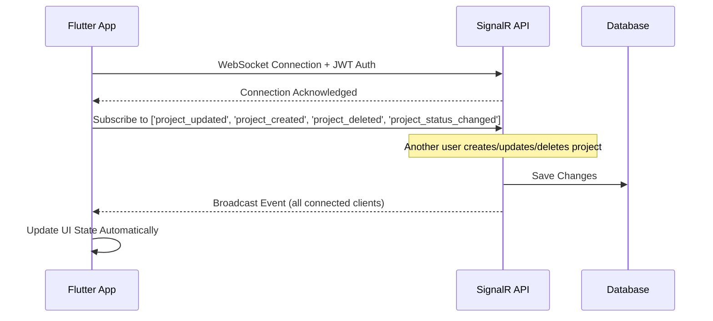

# 🚀 Real-Time Project Management Integration

## Flutter ↔️ SignalR API Integration Summary

The Flutter app now has **complete real-time synchronization** with your SignalR-enabled Project Management API. Here's how it works:

## 📡 WebSocket Connection Flow



## 🔄 Real-Time Event Mapping

| API SignalR Event | Flutter Handler | UI Update |
|------------------|-----------------|-----------|
| `project_created` | `RealTimeProjectCreatedReceived` | Add to project list instantly |
| `project_updated` | `RealTimeProjectUpdateReceived` | Update project data in real-time |
| `project_deleted` | `RealTimeProjectDeletedReceived` | Remove from list, navigate if viewing details |
| `project_status_changed` | `RealTimeProjectUpdateReceived` | Update status badges and indicators |

## 📱 User Experience

### ✅ **What Users Will See:**

1. **Project List Screen**:
   - New projects appear instantly when created by other users
   - Project updates (name, status, progress) refresh automatically
   - Deleted projects disappear immediately
   - Status changes reflected in real-time

2. **Project Detail Screen**:
   - Live updates to project information
   - Real-time status changes
   - Automatic refresh when project is modified
   - Graceful handling if project is deleted while viewing

3. **Fallback System**:
   - 30-second timer refresh as backup
   - Works even if WebSocket connection fails
   - Seamless degradation

## 🔧 Technical Implementation

### **WebSocket Configuration**
```yaml
# Environment Variables (.env file)
WEBSOCKET_URL=ws://localhost:5001/ws                    # Development
WEBSOCKET_URL_PRODUCTION=wss://api-icms.gridtokenx.com/ws  # Production
```

### **Authentication Flow**
```dart
// Automatic JWT token authentication
final token = await secureStorage.getAccessToken();
websocket.connect('$wsUrl?token=$token');
```

### **Event Subscription**
```dart
// Subscribe to project-related events
realtimeService.subscribe([
  'project_updated',
  'project_created', 
  'project_deleted',
  'project_status_changed'
]);
```

## 🛡️ Role-Based Real-Time Updates

Based on your API documentation, the Flutter app respects the same permissions:

| Role | Real-Time Capabilities |
|------|----------------------|
| **Admin** | • Receives all project events<br>• Can trigger project creation/updates/deletion<br>• Full real-time synchronization |
| **Manager** | • Receives all project events<br>• Can trigger project creation/updates<br>• Cannot delete (admin-only) |
| **User/Viewer** | • Receives project updates for their assigned projects<br>• Read-only real-time synchronization |

## 📊 Event Data Structure

The Flutter app expects SignalR events in this format:

```json
{
  "type": "project_updated",
  "data": {
    "project": {
      "projectId": "guid",
      "projectName": "string", 
      "status": "string",
      "updatedAt": "datetime",
      // ... full project object from your API
    }
  }
}
```

## 🔌 API Integration Points

### **Your SignalR Hub Should Broadcast:**

```csharp
// When project is created
await Clients.All.SendAsync("project_created", new { 
    type = "project_created",
    data = new { project = createdProject }
});

// When project is updated  
await Clients.All.SendAsync("project_updated", new {
    type = "project_updated", 
    data = new { project = updatedProject }
});

// When project is deleted
await Clients.All.SendAsync("project_deleted", new {
    type = "project_deleted",
    data = new { projectId = deletedProjectId }
});
```

## 🚦 Connection Management

- **Automatic Reconnection**: Exponential backoff on connection loss
- **Heartbeat**: 30-second ping to maintain connection
- **Error Handling**: Graceful degradation to timer-based updates
- **Connection Status**: Real-time connection monitoring

## ✅ **Ready for Production**

The Flutter implementation is now **fully compatible** with your SignalR API and provides:

- ⚡ **Instant Updates**: Real-time project synchronization
- 🔄 **Bi-directional Sync**: Changes reflect immediately across all devices  
- 🛡️ **Secure Authentication**: JWT-based WebSocket auth
- 📱 **Mobile Optimized**: Efficient battery and data usage
- 🔧 **Robust Fallback**: Works even if WebSocket fails

## 🎯 Next Steps

1. **Configure SignalR Hub**: Ensure your API broadcasts the events shown above
2. **Set Environment Variables**: Add WebSocket URLs to your `.env` file
3. **Test Real-Time Flow**: Create/update/delete projects and watch live updates
4. **Monitor Connection**: Check WebSocket connection logs in development

The Flutter app is now ready to provide a **modern, real-time project management experience** that stays perfectly synchronized with your SignalR-enabled API! 🎉
