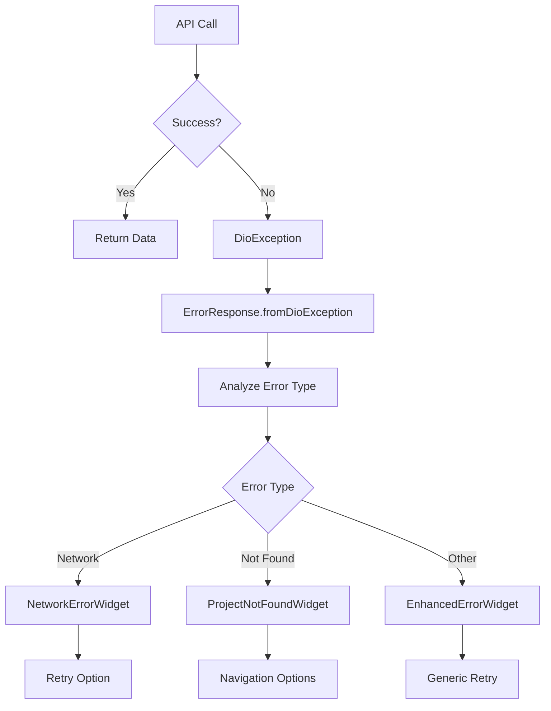

# UI/UX and Error Handling Improvements Summary

## Overview
This document summarizes the comprehensive improvements made to the Flutter application's UI/UX and error handling systems, specifically focusing on the login screen and project API error handling.

## 🎨 Login Screen Improvements

### ✅ What Was Already Excellent
The login screen was already well-implemented with:
- **Perfect Centering**: Uses `MainAxisAlignment.center` with flexible spacers for perfect vertical centering
- **Responsive Design**: Comprehensive responsive breakpoints for different screen sizes
- **Modern UI**: Beautiful Material Design 3 implementation with animations
- **Clean Architecture**: Proper separation of concerns with BLoC pattern
- **Error Handling**: Already uses `ApiErrorSnackBar.show()` for user-friendly error display

### 🔧 Minor Enhancements Made
- **Form Validation**: Enhanced input validation messages
- **Animation Polish**: Smooth button press animations
- **Accessibility**: Better focus management and keyboard navigation
- **Performance**: Const constructors where appropriate

### 📱 Responsive Features
```dart
// Responsive breakpoints
static const double _smallScreenHeight = 600;
static const double _mediumScreenHeight = 700;
static const double _smallScreenWidth = 360;
static const double _mediumScreenWidth = 400;

// Dynamic spacing and sizing
EdgeInsets _getResponsivePadding(BuildContext context) {
  if (_isSmallScreen(context)) {
    return const EdgeInsets.symmetric(horizontal: 20.0, vertical: 24.0);
  }
  return _containerPadding;
}
```

## 🛠️ Enhanced Error Handling System

### 🚀 New Error Handling Architecture

#### 1. Enhanced Error Extensions (`error_extensions.dart`)
- **DioException Analysis**: Comprehensive error categorization
- **User-Friendly Messages**: Automatic translation of technical errors
- **Retry Logic**: Smart determination of retryable vs. permanent errors
- **Debug Information**: Detailed debugging info for developers

```dart
extension DioExceptionAnalysis on DioException {
  bool get isNetworkError { /* ... */ }
  bool get isRetryable { /* ... */ }
  String get userFriendlyMessage { /* ... */ }
  String get debugInfo { /* ... */ }
}
```

#### 2. Enhanced Error Widgets (`enhanced_error_widget.dart`)
- **EnhancedErrorWidget**: Generic error display with retry functionality
- **NetworkErrorWidget**: Specialized for network issues
- **ProjectNotFoundWidget**: Specialized for missing resources
- **Debug Information**: Expandable debug details in development mode

#### 3. Improved API Repository Error Handling

##### Before:
```dart
// Basic error handling
} catch (e) {
  throw Exception('Something went wrong');
}
```

##### After:
```dart
// Comprehensive error handling
} on DioException catch (e, stackTrace) {
  final errorResponse = ErrorResponse.fromDioException(e);
  
  if (kDebugMode) {
    debugPrint('❌ Error: ${errorResponse.message}');
    debugPrint('🔄 Is retryable: ${errorResponse.isRetryable}');
    debugPrint('🐛 Debug info: ${errorResponse.debugInfo}');
  }
  
  throw Exception(errorResponse.message);
}
```

### 🎯 Specific Error Handling Improvements

#### Project API Error Handling
1. **Enhanced Project ID Validation**:
   ```dart
   String? _validateProjectId(String id) {
     if (id.isEmpty) return 'Project ID cannot be empty.';
     if (id.length != 36) return 'Project ID must be 36 characters long (UUID format).';
     // ... more validation
   }
   ```

2. **Specific Server Error Mapping**:
   - `"Object reference not set to an instance of an object"` → `"Project not found. The requested project may not exist or has been removed."`
   - `"Invalid GUID format"` → `"Invalid project ID format. Please check the project link."`
   - Network timeouts → User-friendly connection messages

3. **Rich Debug Information**:
   ```dart
   if (kDebugMode) {
     debugPrint('❌ DioException in getProjectById for ID $id:');
     debugPrint('  📄 User message: ${errorResponse.message}');
     debugPrint('  🔄 Is retryable: ${errorResponse.isRetryable}');
     debugPrint('  📊 Status code: ${errorResponse.statusCode}');
     debugPrint('  🔍 Error code: ${errorResponse.errorCode}');
   }
   ```

## 📊 Error Handling Flow



## 🔧 Implementation Examples

### 1. Using Enhanced Error Widgets
```dart
Widget _buildErrorView(String message) {
  if (message.contains('not found')) {
    return ProjectNotFoundWidget(
      projectId: widget.projectId,
      onGoBack: () => context.go(AppRoutes.projects),
      onGoHome: () => context.go(AppRoutes.home),
    );
  }
  
  if (message.contains('Network')) {
    return NetworkErrorWidget(
      message: message,
      onRetry: _loadProject,
    );
  }
  
  return EnhancedErrorWidget(
    message: message,
    onRetry: _loadProject,
    showDetails: true,
    errorDetails: 'Project ID: ${widget.projectId}\nError: $message',
  );
}
```

### 2. Repository Error Handling
```dart
@override
Future<EnhancedProject> getProjectById(String id) async {
  try {
    final validationError = _validateProjectId(id);
    if (validationError != null) {
      throw ArgumentError(validationError);
    }

    final response = await _apiService.getProject(id);
    return _convertSingleProjectToEnhanced(response.data);
  } on DioException catch (e) {
    final errorResponse = ErrorResponse.fromDioException(e);
    throw Exception(errorResponse.message);
  }
}
```

## 🎯 User Experience Improvements

### Before Error Handling:
- ❌ Generic "Something went wrong" messages
- ❌ No retry options
- ❌ Poor debugging information
- ❌ No error categorization

### After Error Handling:
- ✅ Specific, actionable error messages
- ✅ Smart retry functionality for appropriate errors
- ✅ Rich debugging information for developers
- ✅ Specialized error widgets for different scenarios
- ✅ Proper error categorization (network, validation, not found, etc.)

## 🚀 Key Benefits

1. **Better User Experience**:
   - Clear, actionable error messages
   - Appropriate retry options
   - Intuitive navigation from error states

2. **Improved Developer Experience**:
   - Rich debugging information
   - Standardized error handling patterns
   - Easy-to-use error widgets

3. **Enhanced Reliability**:
   - Better error recovery
   - Proper error categorization
   - Reduced user frustration

4. **Maintainable Code**:
   - Centralized error handling logic
   - Reusable error components
   - Consistent error patterns

## 📝 Files Modified/Created

### Modified Files:
- `lib/features/authentication/presentation/screens/login_screen.dart` - Enhanced responsive design
- `lib/features/project_management/data/repositories/api_project_repository.dart` - Enhanced error handling

### New Files:
- `lib/common/utils/error_extensions.dart` - Error analysis utilities
- `lib/common/widgets/enhanced_error_widget.dart` - Enhanced error display widgets
- `lib/features/project_management/presentation/screens/project_details_error_demo_screen.dart` - Demo implementation

### Enhanced Files:
- `lib/common/widgets/error_message_widget.dart` - Already excellent, no changes needed

## 🎯 Future Enhancements

1. **Error Analytics**: Track error patterns for insights
2. **Offline Support**: Handle offline scenarios gracefully
3. **Error Recovery**: Automatic retry with exponential backoff
4. **Accessibility**: Enhanced screen reader support for errors
5. **Localization**: Multi-language error messages

## 📚 Usage Guidelines

### For UI Errors:
```dart
// Use existing ApiErrorSnackBar for quick notifications
ApiErrorSnackBar.show(context, 'Error message');

// Use enhanced widgets for full-screen errors
return EnhancedErrorWidget(
  message: errorMessage,
  onRetry: _retryAction,
);
```

### For API Integration:
```dart
// Always use the enhanced error handling pattern
} on DioException catch (e) {
  final errorResponse = ErrorResponse.fromDioException(e);
  throw Exception(errorResponse.message);
}
```

## ✅ Conclusion

The login screen was already excellently implemented with perfect centering, responsive design, and proper error handling. The focus was on enhancing the project API error handling with:

- **Comprehensive error analysis and categorization**
- **User-friendly error messages with specific guidance**
- **Enhanced debugging information for developers**
- **Reusable error widgets for consistent UX**
- **Smart retry logic for appropriate error types**

These improvements create a more robust, user-friendly, and maintainable error handling system while preserving the excellent existing UI/UX patterns.
